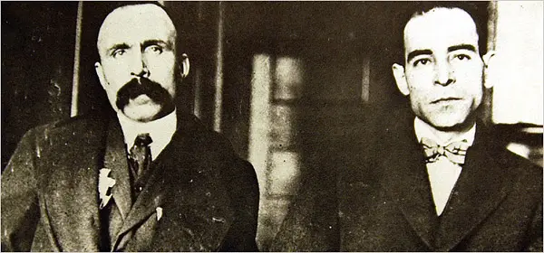

# Abstract

Following news of the Soviet Revolution in 1917, the US institutions of law and order —
whether connected to the government, the courts or law enforcement — initiated strikingly
public and violent actions against leftist ideologies and the many European immigrants who
appeared to have brought them onto American soil. With the so-called “Palmer raids” of late
1919 and early 1920 (named after US Attorney General Mitchell A. Palmer), the United States
Department of Justice ordered the arrest of thousands of suspected socialists, especially
anarchists and communists of Italian and Jewish origins, and deported them from the United
States. The raids involved 36 American cities throughout the country. During this time,
Massachusetts saw the incarceration (1920), sentencing (1921), and execution (1927) of two
Italian American anarchists, Nicola Sacco and Bartolomeo Vanzetti. Although the trial ended
with both men’s conviction of robbery and murder, public opinion agreed that they had been
denied a fair trial by a court biased against their national and political backgrounds.

The scholarship on the case has lacked any major coverage of the perspective of those in
Michigan, a state that due to its intense manufacturing activities, largely linked to the emerging
car industry, had a significant high number of working-class immigrants. Immigrants from Italy
were a minority, but a vocal one. This study analyzes how a few Michigan newspapers, whether
based in Detroit or Lansing, covered the case from 1920 to 1927 (plus a foray into the centennial
of Sacco-Vanzetti’s execution in 1977). The bulk of the analysis comes from two primary news
providers in Michigan — the Detroit Free Press and the Lansing State Journal. Their digital
availability, compared to the Detroit News (another major news organization based in Detroit),
made this research possible.

Our analysis seeks to compare these largely conservative and pro-law-and-order
newspapers’ coverage of the “case of the century” with the more sympathetic one articulated in
Italian-language papers, whether based in Michigan (La voce del Popolo and La Tribuna italiana
del Michigan; available at the Bentley Library) or printed elsewhere in the US, including Il
Cittadino Italo Americano (The Italian American Citizen; one of the most important Italian
American newspapers of the Mid-West) and L'Adunata dei Refrattari (Call of the Refractaries;
the key NYC-based Italian anarchic newspaper of the time).

The goal of this study is to provide an initial, but documented understanding of the range
of responses in Michigan to the Sacco and Vanzetti’s case, in relationship to the many stages of
its primary unfolding in the 1920s as well as in the 1970s, in the context of shifting
demographics and changing local politics.

### Paper Link 

Paper not yet published. Written by Giorgio Bertellini.

Download the paper here: **[PDF](http://google.com)**. <-- Placeholder link